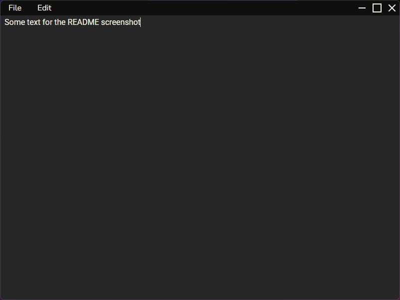

# Stellar
Stellar is designed to be a simple notes taking desktop application.

Stellar was created using [Tauri](https://tauri.app/), a framework for building cross platform binaries. Tauri uses Rust as its backend language with a JavaScript frontend.

## Future Features (If I feel like it)
- [ ] Support for Markdown

## Screenshots (It's just one for now)
